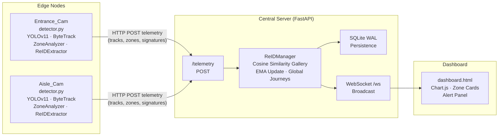

# Multi-Camera Analytics

   

A real-time, multi-camera people-tracking and analytics system. Each camera runs an independent edge inference pipeline (YOLOv11 + ByteTrack + polygon zone analytics + MobileNetV2 ReID embeddings) and streams telemetry to a central FastAPI server that performs cross-camera re-identification, persists data to SQLite, and broadcasts live updates to a WebSocket-driven dashboard.

---

## Architecture



---

## Core Components

### Edge Inference `src/`

| Module | Role |
|---|---|
| [`detector.py`](src/detector.py) | Top-level pipeline per camera; orchestrates all edge components |
| YOLOv11 `.onnx` | Object detection - people only class 0 |
| ByteTrack | Multi-object tracking; assigns stable per-camera track IDs across frames |
| [`spatial_analytics.py`](src/spatial_analytics.py) - `ZoneAnalyzer` | Polygon zone membership, per-track dwell time, occupancy counts, dwell-threshold alerts |
| [`journey_tracker.py`](src/journey_tracker.py) - `JourneyTracker` | Per-camera zone transition tracking; builds funnel and Sankey diagram data |
| [`reid_extractor.py`](src/reid_extractor.py) - `ReIDExtractor` | MobileNetV2 classifier head replaced with `Identity`; extracts 1280-d L2-normalised embeddings from person bounding-box crops every 15 frames; returns JSON-serialisable lists |
| [`telemetry.py`](src/telemetry.py) - `TelemetrySender` | Background-thread HTTP POST to the FastAPI server |
| [`video_streamer.py`](src/video_streamer.py) - `VideoStreamer` | Threaded ring-buffer; decouples frame capture from inference |

Each camera is configured independently via its own YAML file (see [Configuration Schema](#configuration-schema)).

---

### Central Server `backend/`

| Module | Role |
|---|---|
| [`server.py`](backend/server.py) | FastAPI application; receives telemetry, drives ReIDManager, manages WebSocket connections |
| [`reid_manager.py`](backend/reid_manager.py) - `ReIDManager` | Maintains a cross-camera gallery of global_id to embedding; matches incoming embeddings via cosine similarity; assigns new global IDs or merges existing ones; tracks global zone transitions |
| SQLite WAL mode | Persists telemetry snapshots and history for cold-start hydration and time-series queries |

---

### Presentation `frontend/`

| File | Role |
|---|---|
| [`dashboard.html`](frontend/dashboard.html) | Single-page dashboard; WebSocket client; Chart.js rolling occupancy chart; dynamic per-camera zone cards; alert panel |

---

## ReID Pipeline

Cross-camera person re-identification is performed in five stages:

1. **Embedding extraction** - On the edge node, `ReIDExtractor` crops each tracked bounding box and passes it through a headless MobileNetV2 network ImageNet pre-trained, classifier replaced with `nn.Identity`. The resulting 1280-dimensional feature vector is L2-normalised. Extraction runs every **15 frames** per track to balance accuracy and throughput.

2. **Telemetry transmission** - The normalised embedding is serialised as a JSON list and included in the `signatures` field of the telemetry payload POSTed to `/telemetry`.

3. **Gallery matching** - The server's `ReIDManager` computes **cosine similarity** between the incoming embedding and every embedding in the cross-camera gallery.

4. **Identity assignment** - If the best cosine similarity score exceeds the **0.65 threshold**, the track is matched to the existing `global_id`. Otherwise a new `global_id` is minted and added to the gallery.

5. **Gallery update - EMA blending** - On a successful match the gallery embedding is updated with Exponential Moving Average:

   `e_gallery = (0.8 * e_gallery) + (0.2 * e_new)`

   This keeps the reference stable while slowly adapting to appearance changes. Cross-camera matches are logged as ReID events and used to build global zone-transition journeys.

---

## API Specification

| Method | Endpoint | Description |
|---|---|---|
| `WS` | `/ws` | WebSocket - live analytics broadcast to the dashboard |
| `POST` | `/telemetry` | Ingest telemetry from edge nodes tracks, zone states, ReID embeddings |
| `GET` | `/snapshot` | Full current state for cold-start dashboard hydration |
| `GET` | `/history?camera=X&minutes=60` | Time-series occupancy data from SQLite |
| `GET` | `/cameras` | List of active cameras seen by the server |

---

## Deployment Guide

### 1 - Install dependencies

```bash
pip install -r requirements.txt
```

### 2 - Start the central server

```bash
uvicorn backend.server:app --host 0.0.0.0 --port 8000
```

### 3 - Launch edge detectors one per camera

```bash
python src/detector.py --config config.yaml
python src/detector.py --config config_cam2.yaml
```

### 4 - Open the dashboard

Navigate to `frontend/dashboard.html` in a browser (or serve it from any static file server). The page connects to the WebSocket at `ws://localhost:8000/ws` automatically.

---

## Configuration Schema

Each camera is described by a YAML file. Below is the current configuration for **Entrance_Cam** (640 × 480 @ 6 fps):

```yaml
camera:
  name: "Entrance_Cam"
  source: "data/cam1_mall_entrance.mp4"

analytics:
  classes_to_track: [0]          # 0 = person (COCO)
  zones:
    - name: "Entrance"
      color: [0, 255, 150]
      alert_dwell_seconds: 180
      polygon:
        - [60,  90]
        - [540, 90]
        - [540, 280]
        - [60,  280]
    - name: "Shop_Entry"
      color: [255, 100, 0]
      alert_dwell_seconds: 300
      polygon:
        - [548, 110]
        - [640, 110]
        - [640, 300]
        - [548, 300]

model:
  weights: "models/yolo11n.onnx"
  confidence_threshold: 0.45
  iou_threshold: 0.4
```

**Aisle_Cam** (cam2) follows the same schema with zones mapped to product-category displays: `Pots`, `Cups`, `Plates`, and `Bowls`.
